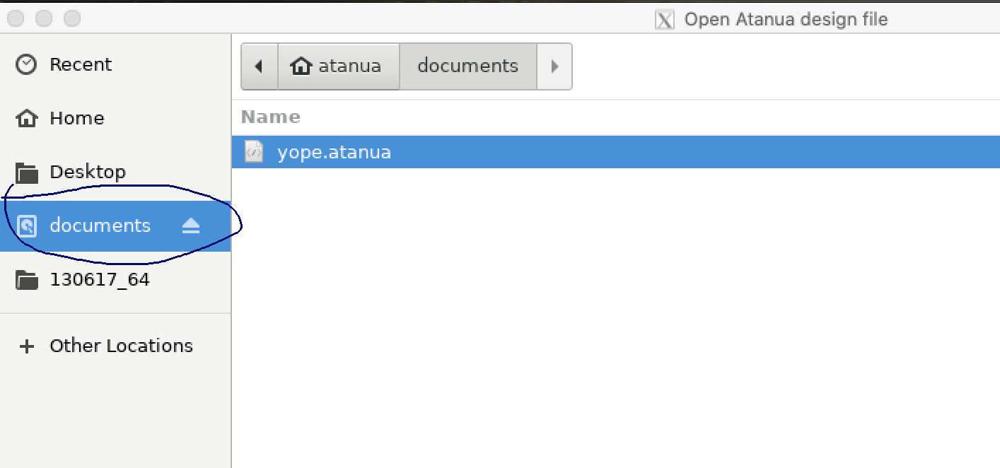

Run [Atanua](https://sol.gfxile.net/atanua) on a modern macbook with the magic of Docker!

Please feel free to open issues and/or PRs as you see fit. This is a public repository, after all.

## Installation

You will need not more than 5 GB to install the dependencies.

### 1. Install docker

https://docs.docker.com/docker-for-mac/install/

To check that the install worked after you're done, run the following command

```
docker --version
```

### 2. Install Xquartz:

Visit the [official site](https://xquartz.org)

### 3. Run the startup script:

Before continuing further, make sure to restart your computer for xquartz to be ready to use.

After restarting you should start Xquartz and go into `Preferences`, then to the `Security` tab and check `Allow connections from network clients`

#### 3.1. Download this project's files
  
1. Download this project's files by clicking the `Code` download button above this README.
2. Unzip the archive
3. Move the folder into your [home folder](https://www.cnet.com/how-to/how-to-find-your-macs-home-folder-and-add-it-to-finder/)

#### 3.2. Open up a terminal and navigate to this project's folder

#### 3.3. Run the following command:

```
./run.sh
```

If you get an error that says something like "cannot open display", try to restart your computer and re-run this script.

## Note

**When saving / loading atanua project files, make sure to use the mounted documents folder 
or else you will lose your work when you exit the program. The resulting files will be saved to
the documents folder where the aforementioned run.sh program is installed.**



## Note

On MacOS to delete items you need to use `fn + delete` as opposed to the regular `del` key in Windows/Linux.

## Credits

Atanua Open Source Project: https://github.com/jarikomppa/atanua

Running GUI’s with Docker on Mac OS X by Nils De Moor: https://cntnr.io/running-guis-with-docker-on-mac-os-x-a14df6a76efc
